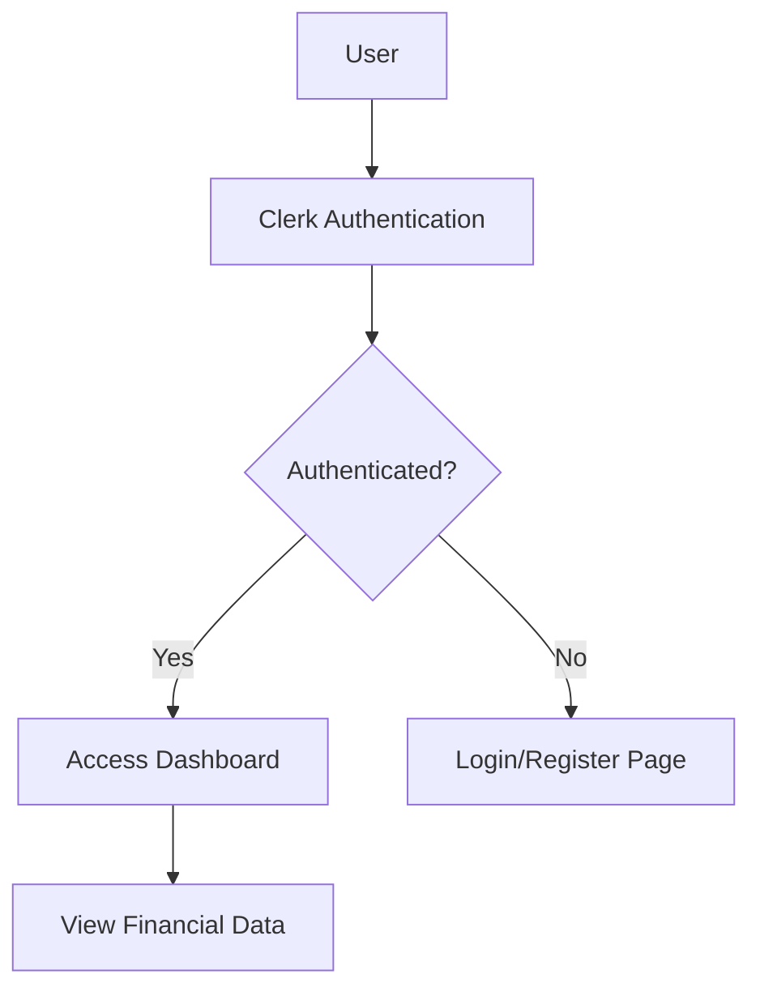
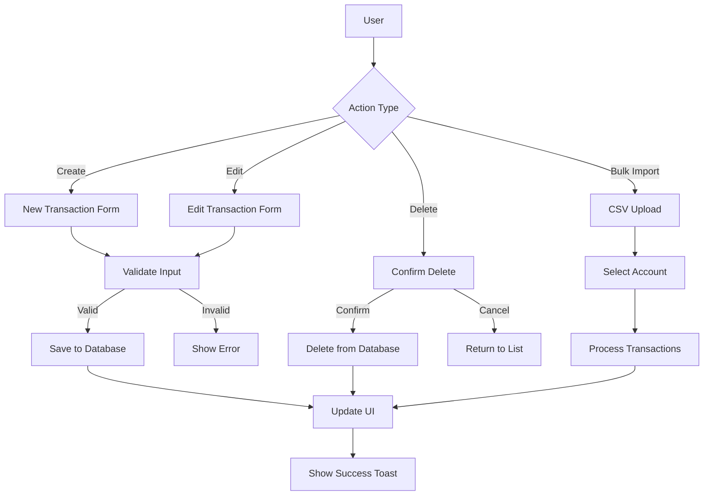
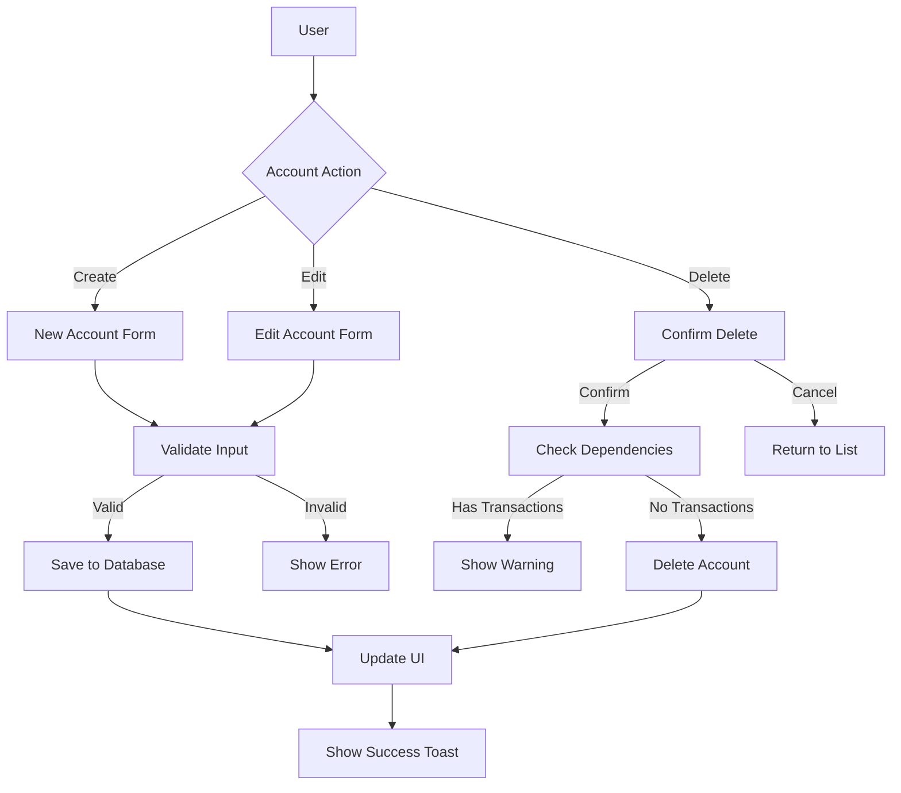
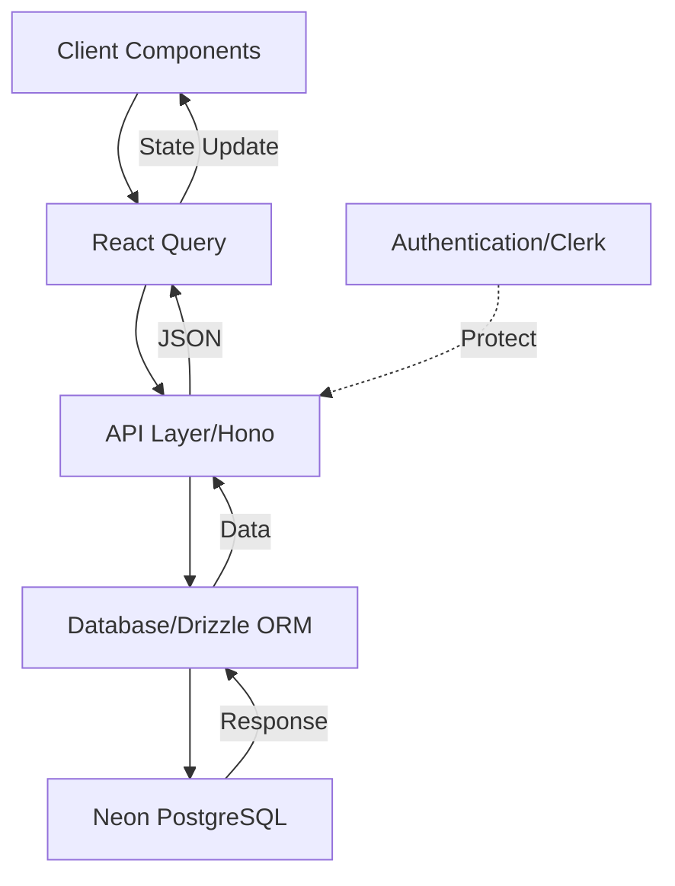
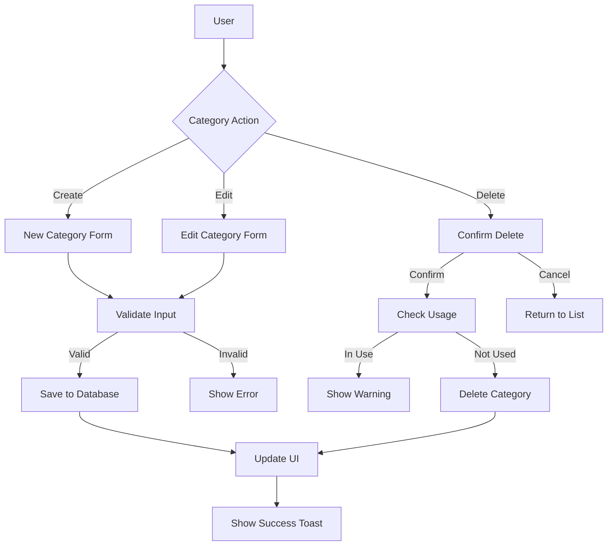
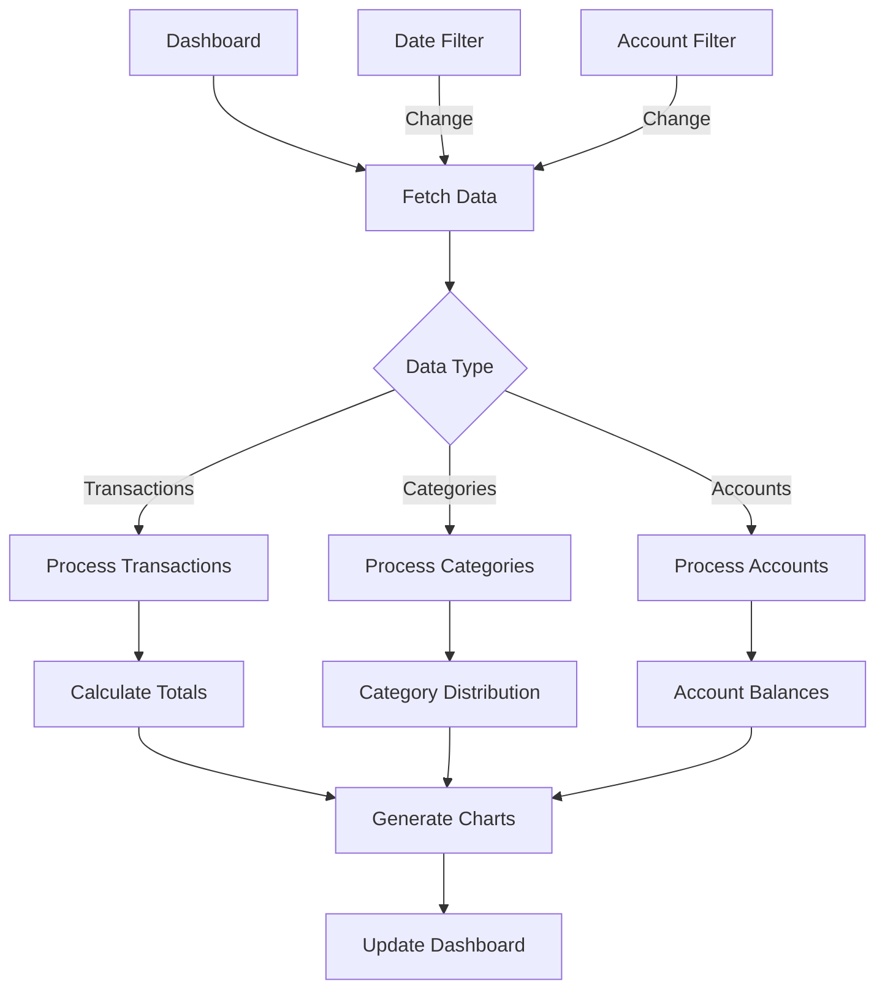

# Finance Dashboard Documentation

## Table of Contents
1. [Project Certificate](#project-certificate)
2. [Project Introduction](#project-introduction)
3. [GitHub Repository](#github-repository)
4. [Flow Charts](#flow-charts)
5. [Technology Stack](#technology-stack)
6. [Testing Strategies](#testing-strategies)
7. [Project Code](#project-code)
8. [Project Screenshots](#project-screenshots)

## Project Certificate
[Insert Project Certificate Here]

## Project Introduction
Finance Dashboard is a modern web application designed to help users track their income and expenses efficiently. The application provides a comprehensive solution for personal finance management with features including transaction tracking, account management, and insightful analytics through interactive charts and reports.

Key Features:
- Transaction management
- Account tracking
- Interactive dashboards
- Data visualization with Recharts
- Secure authentication with Clerk
- CSV import/export functionality
- Dark/Light theme support

## GitHub Repository
[Insert GitHub Repository Link Here]
[Insert Contributors Page Screenshot Here]

## Flow Charts

### 1. Authentication Flow

### 2. Transaction Management Flow

### 3. Account Management Flow

### 4. Data Flow Architecture

### 5. Category Management Flow

### 6. Report Generation Flow

These flowcharts represent the core functionalities and data flows within the Finance Dashboard application. Each chart illustrates the user interactions, system processes, and data management patterns implemented in the codebase.

## Technology Stack

1. **Frontend Framework**: Next.js 14
   - Chosen for its server-side rendering capabilities
   - Built-in routing and API support
   - Excellent developer experience and performance

2. **UI Components**:
   - Radix UI & shadcn/ui for accessible components
   - Tailwind CSS for styling
   - Chosen for customizability and maintainability

3. **State Management**:
   - Zustand for global state
   - React Query for server state
   - Simpler than Redux, perfect for medium-sized applications

4. **Database**:
   - Neon Database (PostgreSQL)
   - Drizzle ORM for type-safe queries
   - Chosen for scalability and serverless compatibility

5. **Authentication**:
   - Clerk for secure user management
   - Comprehensive auth features out of the box

6. **API Layer**:
   - Hono.js for API routes
   - Zod for validation
   - TypeScript for type safety

7. **Charts and Visualization**:
   - Recharts for interactive data visualization
   - React CountUp for animated statistics

## Testing Strategies

1. **Unit Testing**
   - Component-level testing using React Testing Library
   - Isolated function testing

2. **Integration Testing**
   - API endpoint testing
   - Database operations testing
   - Authentication flow testing

3. **E2E Testing**
   - User flow testing
   - Critical path testing

4. **Type Safety**
   - TypeScript for compile-time type checking
   - Zod for runtime validation

5. **Manual Testing**
   - Cross-browser testing
   - Responsive design testing
   - User acceptance testing

## Project Code

Key code sections can be found in the following directories:
- `/app` - Next.js application routes and pages
- `/components` - Reusable React components
- `/lib` - Utility functions and configurations
- `/api` - API routes and handlers
- `/db` - Database schema and migrations

## Project Screenshots

[Insert screenshots of the following pages]
1. Dashboard Overview
2. Transaction Management
3. Account Management
4. Categories Management
5. Transaction Creation/Edit Modal

---

*Note: This documentation is a living document and will be updated as the project evolves.* 